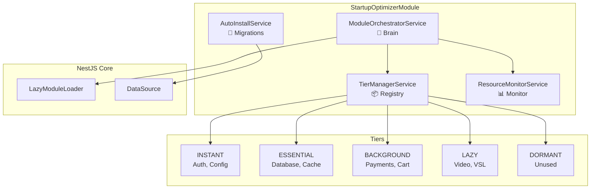
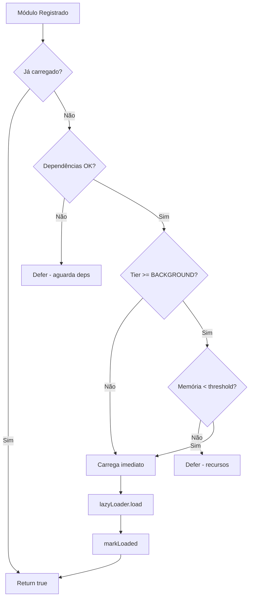

# Arquitetura do Startup Optimizer

Este documento descreve a arquitetura interna do módulo `@gomo-hub/startup-optimizer`.

## Visão Geral

O Startup Optimizer implementa a **Progressive Module Architecture (PMA)**, uma arquitetura inovadora para otimização de startup em sistemas NestJS de grande escala.

## Diagrama de Arquitetura



## Componentes

### 1. ModuleOrchestratorService (🧠 Brain)

O cérebro do sistema. Responsável por:

- Decidir **quando** carregar cada módulo
- Verificar recursos antes de carregar
- Gerenciar o ciclo de vida do bootstrap

```typescript
interface OrchestratorResponsibilities {
    loadTier(tier: ModuleTier): Promise<void>;
    loadModule(registration: ModuleRegistration): Promise<boolean>;
    ensureLoaded(moduleName: string): Promise<boolean>;
    ensureLoadedForRoute(route: string): Promise<boolean>;
}
```

### 2. TierManagerService (📦 Registry)

Registro central de todos os módulos e seus tiers:

- Armazena metadados de cada módulo
- Rastreia status de carregamento
- Gerencia dependências entre módulos
- Permite promoção/demoção dinâmica de tiers

```typescript
interface TierManagerResponsibilities {
    register(registration: ModuleRegistration): void;
    getModulesByTier(tier: ModuleTier): ModuleRegistration[];
    markLoaded(name: string): void;
    promoteTier(name: string): void;
    demoteTier(name: string): void;
}
```

### 3. ResourceMonitorService (📊 Monitor)

Monitora recursos do sistema:

- Uso de memória (heap)
- Histórico de snapshots
- Tendências (aumentando/estável/diminuindo)

```typescript
interface ResourceMonitorResponsibilities {
    getCurrentUsage(): ResourceSnapshot;
    canLoadModule(threshold: number): boolean;
    getMemoryTrend(): 'increasing' | 'stable' | 'decreasing';
}
```

### 4. AutoInstallService (🔧 Migrations)

Instalação automática do schema:

- Executa SQL migrations no bootstrap
- Cria tabela `startup_optimizer_usage`
- Verifica se tabelas já existem

## Fluxo de Carregamento

```mermaid
sequenceDiagram
    participant App as NestFactory
    participant Opt as Orchestrator
    participant Tier as TierManager
    participant Res as ResourceMonitor
    participant Mod as Lazy Modules

    Note over App: bootstrap()
    App->>Opt: onApplicationBootstrap()
    
    Opt->>Tier: getModulesByTier(ESSENTIAL)
    loop Para cada módulo
        Opt->>Res: canLoadModule(80%)
        Res-->>Opt: true
        Opt->>Mod: lazyLoader.load(module)
        Opt->>Tier: markLoaded(name)
    end
    
    Note over Opt: setTimeout(2000ms)
    
    Opt->>Tier: getModulesByTier(BACKGROUND)
    loop Para cada módulo
        Opt->>Res: canLoadModule(80%)
        alt Memory OK
            Opt->>Mod: lazyLoader.load(module)
        else Memory exceeded
            Note over Opt: Defer to LAZY
        end
    end
```

## Estrutura de Diretórios

```
src/
├── domain/
│   ├── entities/
│   │   └── module-usage.entity.ts    # Tracking para prediction
│   └── interfaces/
│       └── startup-optimizer.interface.ts
│
├── application/
│   └── services/
│       ├── module-orchestrator.service.ts  # 🧠 Brain
│       ├── tier-manager.service.ts         # 📦 Registry
│       └── resource-monitor.service.ts     # 📊 Monitor
│
├── infrastructure/
│   └── auto-install/
│       ├── auto-install.service.ts
│       └── migrations/
│           └── 001_initial_schema.sql
│
├── startup-optimizer.module.ts
└── index.ts
```

## Padrões de Design Utilizados

| Padrão | Onde | Por quê |
|--------|------|---------|
| **Registry** | TierManagerService | Centraliza metadados de módulos |
| **Observer** | ResourceMonitor | Monitora eventos de memória |
| **Strategy** | ModuleTier enum | Diferentes estratégias de carregamento |
| **Lazy Initialization** | LazyModuleLoader | Carrega sob demanda |
| **Factory** | forRoot/forRootAsync | Configuração flexível |

## Decisão de Carregamento



## Extensibilidade

### Adicionando Novo Tier

```typescript
export enum ModuleTier {
    INSTANT = 0,
    ESSENTIAL = 1,
    BACKGROUND = 2,
    LAZY = 3,
    DORMANT = 4,
    // Novo tier:
    PRELOAD_ON_IDLE = 5,  // Carrega quando CPU está idle
}
```

### Demand Prediction (Futuro)

```typescript
@Injectable()
export class DemandPredictorService {
    async predictNextModules(tenantId: string): Promise<string[]> {
        // Analisa padrões de uso do tenant
        // Retorna módulos que provavelmente serão usados
    }
}
```
