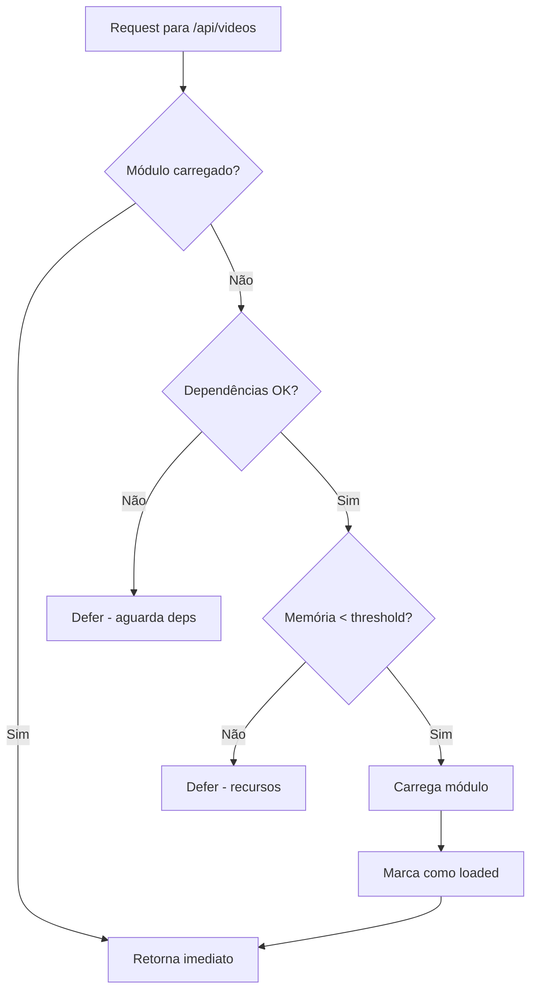

# Fluxo do Startup Optimizer

Este documento descreve o fluxo de carregamento de módulos usando a Progressive Module Architecture (PMA).

## Diagrama de Fluxo

```mermaid
sequenceDiagram
    participant App as AppModule
    participant Opt as StartupOptimizer
    participant Tier as TierManager
    participant Res as ResourceMonitor
    participant Lazy as LazyModuleLoader

    App->>Opt: bootstrap()
    Note over Opt: INSTANT tier já carregado

    Opt->>Tier: getModulesByTier(ESSENTIAL)
    Opt->>Res: canLoadModule(80%)
    Res-->>Opt: true
    Opt->>Lazy: load(DatabaseModule)
    Opt->>Lazy: load(CacheModule)

    Note over Opt: 2s delay

    Opt->>Tier: getModulesByTier(BACKGROUND)
    Opt->>Res: canLoadModule(80%)
    alt Memory < 80%
        Opt->>Lazy: load(PaymentsModule)
        Opt->>Lazy: load(CartModule)
    else Memory >= 80%
        Note over Opt: Defer to LAZY
    end

    Note over Opt: LAZY modules wait for request

    App->>Opt: ensureLoadedForRoute("/api/videos")
    Opt->>Tier: getModuleByRoute("/api/videos")
    Tier-->>Opt: VideoComposerModule
    Opt->>Lazy: load(VideoComposerModule)
```

## Decisão de Carregamento


